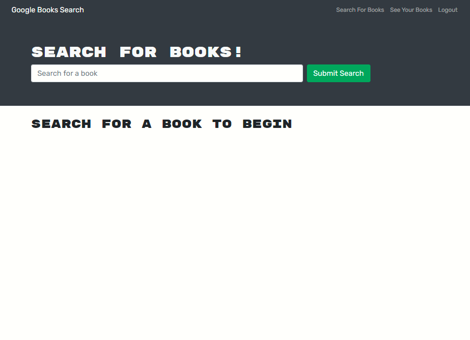

# Book Search Engine

# License
  

# Table of Contents

- [Description](#description)
- [Installation](#installation)
- [Links](#links)
- [Screenshot](#screenshot)
- [Questions](#questions)

# Description
This is a full MERN project consisting of a full functioning website that allows users to sign up, log in, search/save/delete in a wide-range collection of books.  This was tested using graphQL from the server side and the front-end was tested by running 'npm start'.

# Built With
- Javascript
- HTML
- CSS
- React
- MERN Stack
- MongoDB
- Node.js

# Installation
- Cloning of the repository is an option. Otherwise, visiting the deployed website is fine.
- Install npm packages by running 'npm i' in your terminal
- Run 'npm start' to begin application

# Links
- Link to repository: https://github.com/itsrheine/book-search-engine
- Link to website: https://rocky-plateau-77798.herokuapp.com/

# Screenshot

# Questions
If you have any questions or concerns, please feel free to reach out to my:
- Email: [mtiamsic@gmail.com](mtiamsic@gmail.com)
- Github: [itsrheine](https://github.com/itsrheine)
